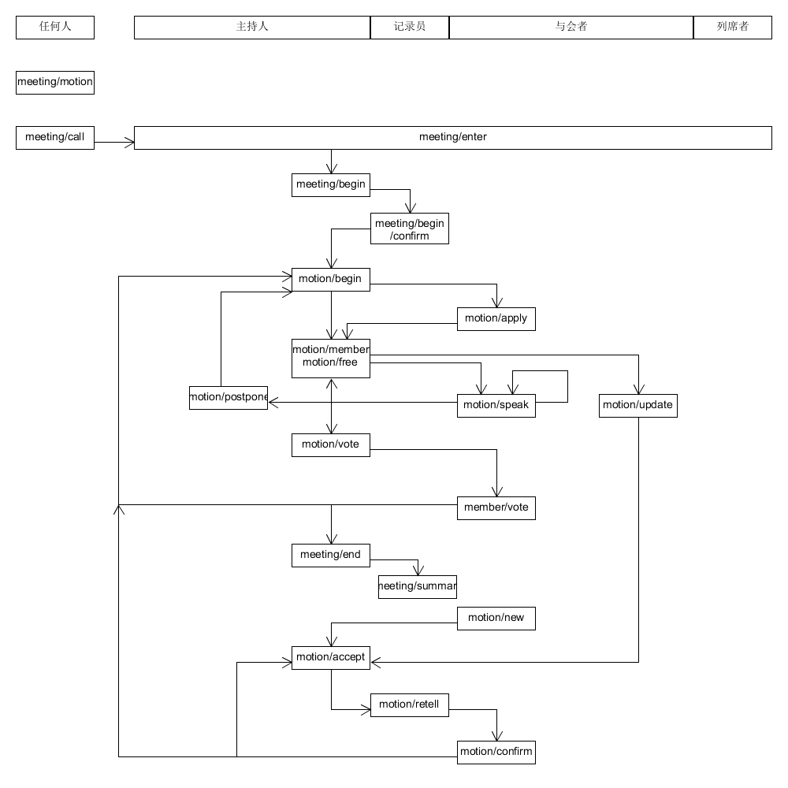

# meeting
[项目成员会议：在线议事规则](http://blog.sina.com.cn/s/blog_591ac304010186yg.html)的软件实现。

## 16:30~17:59
meeting

https://github.com/hyg/meeting  
会议的API及代码实现

### API
这套接口只考虑单次会议，会议与成员的关系由共同体模型规定，不考虑会议之间的任务：
* 由召集人选定与会者，与会者自行判断召集人是否合法。
* 不再安排会议合法性的投诉接口
* 不再确认前次会议决议的合法性

如果是保密会议，所有信息使用公钥加密，会议纪要由记录员决定是否发布。

* meeting/motion：提交动议。
* meeting/call：召集通知。
	* motion list：纳入议程的动议清单。
	* 时间
	* 入口url（软件自动生成的可以不操作）
	* open: yes | no
		* no: member list：与会者名单，逐一选定。
	* 保密：yes | no
		* （如果保密的话）列席人员名单
	* 主持人
	* 记录员
* meeting/enter：主持人、记录员、与会者、列席者进入入口时自动发出。
	* member ID
	* enter time
	* sig
* meeting/begin：由主持人决定开会。（考虑各种特殊情况，软件暂不检查时间）
	* meeting/begin/confirm：记录员根据到场人员确认会议合法性。
	* meeting/begin/fail：记录员根据到场人员确认会议无法召开。
* meeting/end：由主持人决定散会。
	* meeting/summary：如果是保密会议，由记录员数字签名并提交，才会发布会议纪要。暂定三分钟超时。
		* meeting ID

* motion/new：临时动议。与会前提交动议不同，需要复述、确认。
	* motion/accept：主持人接受动议，意味着记录员准备复述。
		* motion ID
	* motion/retell：记录员复述动议。
	* motion/confirm：提议人确认复述。
* motion/update：修订动议。
	* motion ID
	* update ID（软件生成）
	* update：...
	* motion/accept：主持人接受动议，意味着记录员准备复述。
		* motion ID
		* update ID
 	* motion/retell：记录员复述动议。
	 	* motion ID
	 	* update ID
	 	* content
	* motion/confirm：提议人确认复述。
		* motion/retell
		* yes | no
			* update if no
* motion/begin：主持人决定开始一个动议。
	* motion ID
* motion/apply：与会者向主持人提出发言。
* motion/member：主持人指定发言人及时间。
	* member ID：
	* time：
* motion/free：自由发言，同一名发言人发言间隔不能少于time。
	* time:
* motion/speak：发言。
* motion/postpone：搁置动议。简化在主持人手中，与会者可在发言事件下提出。
* motion/vote：主持人决定开始表决。
	* motion ID
	* time：不得少于一分钟
* member/vote：与会者提交表决结果。
	* motion ID
	* vote：

### 主持人
* meeting/call  --> meeting/enter --> meeting/begin --> 记录员meeting/begin/confirm --> \*1 motion/begin | meeting/end  --> motion/member | motion/free [--> motion/vote] --> motion/postpone --> \*1 
* 与会者 motion/update | motion/new  --> motion/accept
* 与会者 motion/confirm --> 主持人 motion/accept | 主持人motion/begin（打断复述-确认循环）
* 可以看到 motion/apply （其他人看不到）
* 可以看到 motion/new （其他人看不到）

### 记录员
* meeting/enter 
* 主持人 meeting/begin --> meeting/begin/confirm | meeting/begin/fail 
* 主持人 motion/accept --> motion/retell 
* 主持人 meeting/end --> （如果是保密会议，又要发布会议纪要）meeting/summary

### 与会者 member
* meeting/motion
* meeting/enter 
* motion/apply --> 主持人 motion/member --> motion/speak | motion/update
* 主持人 motion/vote --> member/vote
* motion/new --> （只有主持人能看到）
* 记录员 motion/retell --> motion/confirm --> 主持人 motion/accept | 主持人motion/begin（打断复述-确认循环）记录员不必直接复述，先等等主持人决定。

### 列席者
meeting/enter --> 显示会议过程

### 会议记录
软件自动生成，包括所有事件。如果是保密会议，使用全员公钥加密。

### 会议纪要
由系统自动生成，不加密。如果是保密会议，由记录员决定是否发布。

* meeting/call
* meeting/enter
* meeting/begin
	* meeting/begin/confirm
* motion list
	* motion content
	* member/vote list

### 待增加
* 主持人、记录员选举、罢免
* 记录员驱逐与会者
* 提供动议（决议？）对接执行规章的api？
* 一个共同的event queue，每人一个local的event queue，取两边当前事件的较早一个送入状态机。

## FSM

### s0
初始状态

* everyone: meeting/motion
	* s0
* everyone: meeting/call
	* s1

### s1
召集中

* everyone: meeting/enter
* 主持人: meeting/begin
	* s2

### s2
启动检查

* 记录员: meeting/begin/confirm
	* s3
* 记录员: meeting/begin/fail
	* s1

### s3
会议中、动议间（meeting ID）

* 主持人: motion/begin
	* s4
* 主持人: meeting/end
	* 保密会议: s9
	* 公开会议: s10
* 与会者: motion/new
* 主持人: motion/accept
	* s7

### s4
动议中、发言间（motion ID）

* 与会者: motion/apply
* 主持人: motion/member
	* s5-1
* 主持人: motion/free
	* s5-2

* 主持人: motion/vote
	* s6
* 主持人: motion/postpone
	* s3

### s5-1
发言中（member ID）

* enter: timeout = motion/member.time
* 与会者（member ID）: motion/speak
	*  s4
* 与会者: motion/update
	* s4
* timer: timeout
	* s4
* 主持人: motion/free
	* s5-2

### s5-2
自由发言中

* 与会者（timeout）: motion/speak
	* timeout = motion/member.time
* 与会者: motion/update
	* s4
* 主持人: motion/vote
	* s6
* 主持人: motion/postpone
	* s3
* 主持人: motion/member
	* s5-1

### s6
表决中（motion ID）

* enter: timeout = motion/vote.time
* 与会者: member/vote
	* 最后一名与会者提交: s3
* timer: timeout
	* s3

### s7
动议复述中（motion ID [update ID])

* 记录员: motion/retell
	* s8

### s8
动议确认中（motion ID [update ID])

* 与会者（动议者）: motion/confirm
	* s3

### s9
会议纪要

* enter: timeout = 180s

* 记录员: meeting/summary
	* s10
* timer: timeout
	* s10

### s10
结束状态

## Activity Diagram

